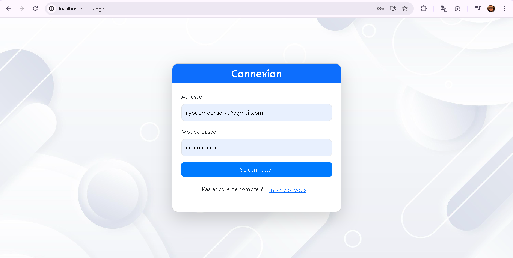

# Application de Gestion des Routes (RoutePro)

## 📝 Description
RoutePro est une application web complète de gestion des routes qui permet aux utilisateurs de gérer et suivre efficacement les itinéraires. L'application dispose d'une interface utilisateur intuitive et d'un système d'authentification robuste, offrant des fonctionnalités différentes pour les administrateurs et les utilisateurs standard.

## 🚀 Fonctionnalités

### Pour les Administrateurs
- Gestion complète des itinéraires
- Tableau de bord administratif
- Suivi des utilisateurs
- Gestion des permissions

### Pour les Utilisateurs
- Consultation des itinéraires disponibles
- Suivi des parcours
- Interface personnalisée
- Gestion du profil utilisateur

## 📸 Captures d'écran

### Page de Connexion


### Tableau de Bord Administrateur


### Tableau de Bord Utilisateur


## 🛠 Technologies Utilisées

### Frontend
- **React.js** - Framework JavaScript pour l'interface utilisateur
- **Context API** - Gestion de l'état global
- **CSS** - Stylisation
- **Axios** - Client HTTP pour les requêtes API

### Backend
- **Node.js** - Environnement d'exécution JavaScript
- **Express.js** - Framework web pour Node.js
- **MongoDB** - Base de données NoSQL
- **JWT** - Authentification et autorisation

## 🏗 Structure du Projet

```
├── RoutePro_Backend/        # Backend de l'application
│   ├── src/
│   │   ├── api/            # Configuration API
│   │   ├── controller/     # Contrôleurs
│   │   ├── database/      # Configuration BD
│   │   ├── model/         # Modèles
│   │   └── routes/        # Routes API
│
├── RoutePro-Frontend/      # Frontend de l'application
│   ├── public/            # Fichiers statiques
│   └── src/
│       ├── components/    # Composants React
│       ├── services/      # Services API
│       └── context/       # Context API
```

## 🚀 Installation et Démarrage

### Prérequis
- Node.js (v14 ou supérieur)
- MongoDB
- npm ou yarn

### Installation Backend
```bash
cd RoutePro_Backend
npm install
npm start
```

### Installation Frontend
```bash
cd RoutePro-Frontend
npm install
npm start
```

## 🔒 Variables d'Environnement
Créez un fichier `.env` dans le dossier backend avec les variables suivantes :
```env
MONGODB_URI=votre_uri_mongodb
JWT_SECRET=votre_secret_jwt
PORT=5000
```

## 👥 Contribution
Les contributions sont les bienvenues ! N'hésitez pas à ouvrir une issue ou à soumettre une pull request.

## 📄 Licence
Ce projet est sous licence MIT.

## 👨🏻‍💻 Auteur
**Ayoub MOURADI**
